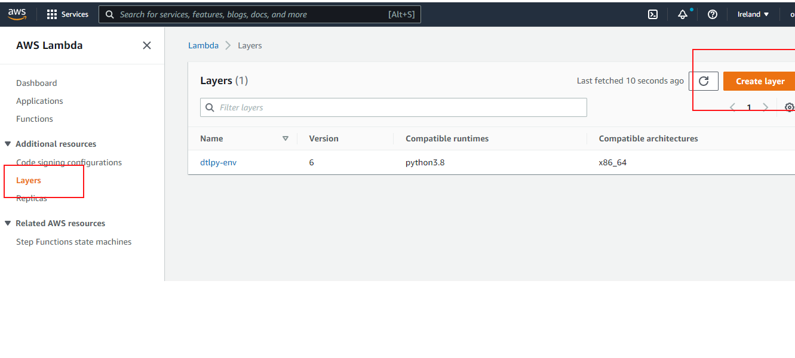
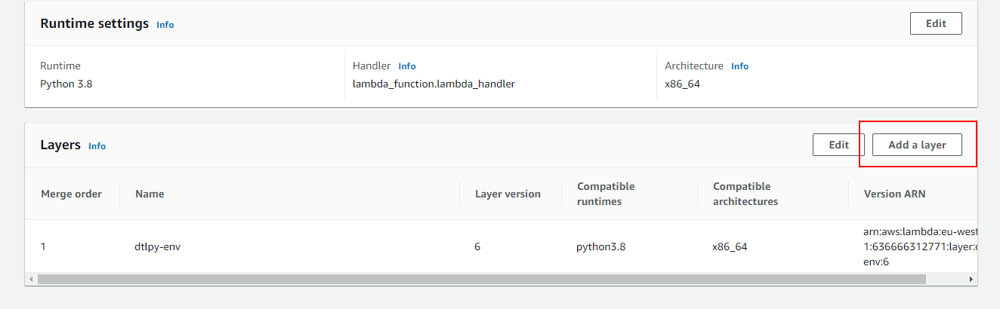

# Connecting Dataloop with AWS S3 🌉

Ever wondered how to connect your AWS S3 buckets seamlessly with Dataloop? You're in the right place! Let's walk through the process step by step, from setting up your integration to automating your data sync.

## Step 1: Setting Up AWS Integrations 🔗

Before we can start moving data around, we need to establish a secure connection between Dataloop and AWS. You've got two options:

### Option 1: AWS Access-Key Integration 🔑

Here's the quick way to set up using access keys:

```python
import dtlpy as dl
if dl.token_expired():
    dl.login()
organization = dl.organizations.get(organization_name='my-org')
organization.integrations.create(
    name='S3integration',
    integrations_type=dl.ExternalStorage.S3,
    options={'key': "my_key", 'secret': "my_secret"}
)
```

### Option 2: AWS Cross Account Integration 🤝

For those who prefer the more secure cross-account approach, here's your step-by-step guide:

1. Create your S3 bucket
2. Set up an IAM policy
3. Create the integration and get your Dataloop IAM user:

```python
import dtlpy as dl
if dl.token_expired():
    dl.login()
# Get your project
project = dl.projects.get(project_id='<YOUR_PROJECT_ID>')

# Create the integration
integration: dl.Integration = project.integrations.create(
    integrations_type=dl.IntegrationType.AWS_CROSS_ACCOUNT,
    name='<YOUR_INTEGRATION_NAME>',
    option={}
)

# Get the IAM user ARN (you'll need this!)
for metadata in integration.meatadata:
    if metadata['name'] == 'userArn':
        iam_user_arn_value = metadata['value']
    elif metadata['name'] == 'status':
        integration_status = metadata['value']

print('🎯 IAM User ARN:', iam_user_arn_value)
print('📊 Integration Status:', integration_status)
```

4. Create your IAM role
5. Add the IAM user to your role's trust relationship
6. Update the integration with your role ARN:

```python
# Complete the setup with your role ARN
integration.update(new_options={'roleArn': '<YOUR_IAMֹֹֹֹֹ_ROLE_ֹֹARN>'})
updated_integration = project.integrations.get(integrations_id=integration.id)

# Verify everything's working
for metadata in updated_integration.meatadata:
    if metadata['name'] == 'status':
        if metadata['value'] != 'trust-established':
            raise ValueError('⚠️ Oops! Integration setup needs attention - check your IAM Role trust relationship')
```

## Step 2: Creating Your Storage Driver 🎯

Now that we have our integration set up, let's create a storage driver - think of it as your personal data concierge that connects your specific S3 bucket to Dataloop.

```python
import dtlpy as dl
project = dl.projects.get('<project_name>')
driver = project.drivers.create(
    name='s3_driver',
    driver_type=dl.ExternalStorage.S3,
    integration_id='<integration_id>',
    bucket_name='<bucket_name>',
    allow_external_delete=True,
    region='eu-west-1',
    storage_class="",
    # If your path is s3://my-s3-bucket/folder, use only 'folder'
    path="<folder_name>" 
)
```

Once your driver is ready, you can create a dataset:

```python
dataset = project.datasets.create(dataset_name=dataset_name, driver=driver)
# sync the dataset 
dataset.sync()
```

## Step 3: Syncing Your Data 🔄

### Manual Sync ⚡

Need to sync a specific item? Here's your shortcut:

```python
import dtlpy as dl
# Use the full item path in AWS context
item_path = 'external://' + '<Your_item_full_name>'
# Optional: specify a destination folder
remote_path = '/'
dataset = dl.datasets.get(dataset_id='<dataset-id>')
dataset.items.upload(local_path=item_path, remote_path=remote_path)
```

### Automatic Sync with AWS Lambda ✨

Want your Dataloop dataset to automatically stay in sync with your S3 bucket? Let's set up a Lambda function!

#### Setting Up Your Lambda Function 🛠️

1. Create a new Lambda function
2. Extend the timeout to 1 minute (the default 3 seconds won't cut it!)
3. Add these environment variables:
   - `DATASET_ID`
   - `DTLPY_USERNAME`
   - `DTLPY_PASSWORD`

Need those credentials? Here's how to get them:

```python
import dtlpy as dl
project = dl.projects.get(project_name='project name')
bot = project.bots.create(name='serviceAccount', return_credentials=True)
print('🤖 Bot username:', bot.id)
print('🔑 Bot password:', bot.password)
```

4. The Lambda Code 

Copy the following code to your lambda function:

```python
import os
import urllib.parse
import traceback
import logging
from pathlib import Path
# Set dataloop path to tmp (to read/write from the lambda)
os.environ["DATALOOP_PATH"] = "/tmp"
import dtlpy as dl

DATASET_ID = os.environ.get('DATASET_ID')
DTLPY_USERNAME = os.environ.get('DTLPY_USERNAME')
DTLPY_PASSWORD = os.environ.get('DTLPY_PASSWORD')

logger = logging.getLogger()
logger.setLevel(logging.INFO)

def lambda_handler(event, context):
    dl.login_m2m(email=DTLPY_USERNAME, password=DTLPY_PASSWORD)
    dataset: dl.Dataset = dl.datasets.get(dataset_id=DATASET_ID)
    driver_path = dl.drivers.get(driver_id=dataset.driver).path
    for record in event['Records']:
        # Get the file name, e.g. /panorama0/Bul_04/frame_000000.jpg
        filepath = urllib.parse.unquote_plus(record['s3']['object']['key'], encoding='utf-8')
        path = Path(filepath)
        directory = str(path.parent)
        filename = path.name
        
        if driver_path is not None and driver_path not in filepath:
            # event is not from the path of the driver, we don't need to do anything
            return
            
        if driver_path is not None:
            remote_path = Path(directory.replace(driver_path, ''))
        else:
            remote_path = Path(directory)
            
        if not remote_path.is_absolute():
            remote_path = Path('/') / remote_path
            
        if 'ObjectRemoved' in record['eventName']:
            # On delete event - delete the item from Dataloop
            try:
                dtlpy_filename = str(remote_path / filename)
                filters = dl.Filters(field='filename', values=dtlpy_filename)
                dataset.items.delete(filters=filters)
            except Exception as e:
                logger.error(traceback.format_exc())
                raise e
        elif 'ObjectCreated' in record['eventName']:
            # On create event - add a new item to the Dataset
            try:
                # upload the file
                external_path = f'external://{filepath}'
                # dataset.items.upload(local_path=path, overwrite=True) # if overwrite is required
                dataset.items.upload(local_path=external_path,
                                  remote_path=str(remote_path),
                                  remote_name=filename)
            except Exception as e:
                logger.error(traceback.format_exc())
                raise e

```

5. Add a Layer to the Lambda  

We have created an AWS Layer with the Dataloop SDK ready. Click [here](https://storage.googleapis.com/dtlpy/aws-python3.8-lambda-layer/layer.zip) to download the zip file.  
Because the layer's size is larger than 50MB you cannot use it directly (AWS restrictions), but need to upload it to a bucket first.  
Once uploaded, create a new layer for the dtlpy env:  
a. Go to the layers screen and "click Add Layer".  
  
b. Choose a name (dtlpy-env).  
c. Use the link to the bucket layer.zip.  
d. Select the env (x86_64, python3.8).  
e. Click "Create" and the bottom on the page.  
  
Go back to your lambda and add the layer:  
a. Select the "Add Layer".  
  
b. Choose "Custom layer" and select the Layer you've added and the version.  
c. click "Add" at the bottom.  
  
6. Create the Bucket Events  
Go to the bucket you are using, and create the event:  
a. Go to Properties → Event notifications → Create event notification  
b. Choose a name for the Event  
c. For Event types choose: All object create events, All object delete events  
d. Destination - Lambda function → Choose from your Lambda functions → choose the function you build → SAVE  


## Need More Help? 🤔

For detailed AWS cross-account integration setup, check out our [comprehensive documentation](https://docs.dataloop.ai/docs/integrations-overview).

Happy data syncing! 🚀

