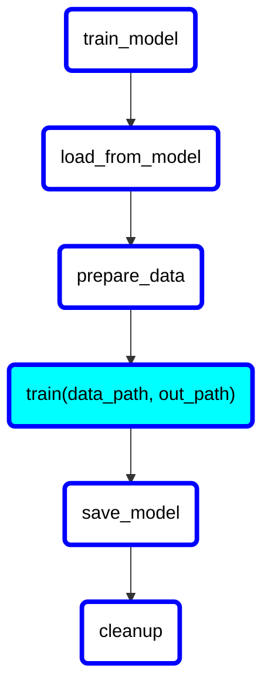

```mermaid
flowchart TD
    id1(train_model)-->id2(load_from_model)-->id3(prepare_data)-->id4("train(data_path, out_path)")-->id5(save_model)-->id6(cleanup)
    style id1 fill:white,stroke:blue,stroke-width:4px,color:black
    style id2 fill:white,stroke:blue,stroke-width:4px,color:black
    style id3 fill:white,stroke:blue,stroke-width:4px,color:black
    style id4 fill:cyan,stroke:blue,stroke-width:4px,color:black
    style id5 fill:white,stroke:blue,stroke-width:4px,color:black
    style id6 fill:white,stroke:blue,stroke-width:4px,color:black

```