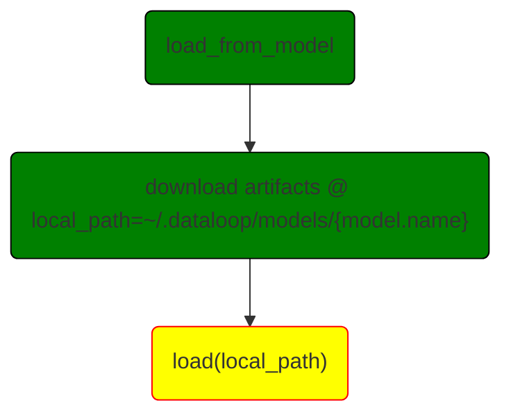
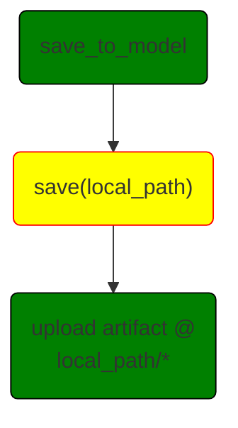
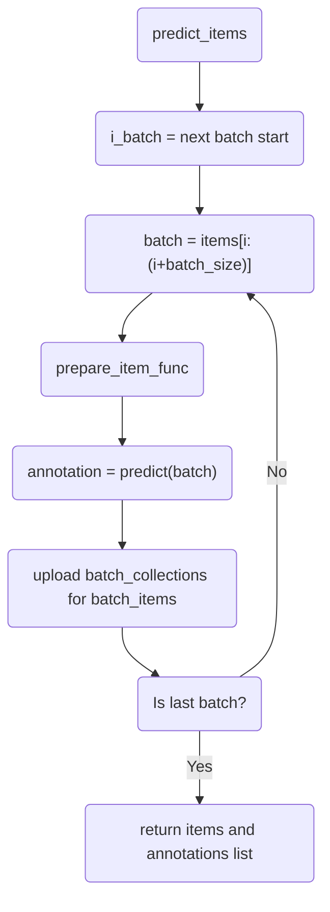
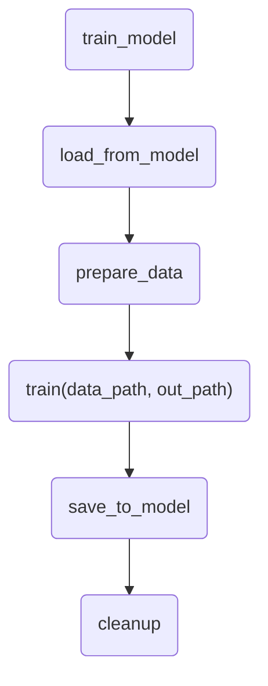
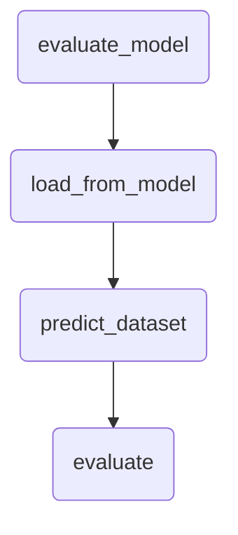

# Model Adapter Class Methods

In this tutorial, we can see the flowcharts for the Model Adapter functiions. There are two main types of functions:

* **Wrapper Functions**: Those are functions that come as part of the ```BaseModelAdapter``` class and perform most of the auxiliary tasks needed for adapting a machine learning model to the Dataloop format.
* **User Functions**: Each wrapper function will call a user function, i.e. a function implemented by the user with the specific code related to the model they wish to adapt.

In the following sections we will see explanations for each function of each category.

## Wrappers Functions

Here we will see the flowcharts explaining the logic of the wrapper functions. The blocks in green show operations performed by the wrapper function, while blocks in yellow show a call to a user function, which will require implementation.

### `load_from_model`



The ```load_from_model``` function performs starts by downloading artifacts as seen in the ```download_artifacts``` block. It will define the variable ```local_path``` to the path ```~/.dataloop/models/{model.name}``` where ```{model.name}``` will be filled with the name of the model as defined during its creation. Inside this directory, the ```model.artifacts``` will be downloaded. Those usually include weight files, but can include any other auxiliary files needed by the model that were uploaded by the user. More information at [this page](https://developers-dev.redoc.ly/tutorials/model_management/introduction/chapter/#artifacts-and-codebase).

Once all files are in ```local_path``` the user function ```load``` is invoked. Its explanation can be found [below](#load).

The directory structure will be, considering that ```~/.dataloop``` is the default ```DATALOOP_PATH```:

```shell
Directory tree at this stage:
DATALOOP_PATH
|-- models
|   |-- model.name
|      |-- artifacts
```

### `save_to_model`




The ```save_to_model``` function invokes the ```save``` user function explained [below](#save) and then uploads all the files in ```local_path``` as model artifacts, as described [here](https://developers-dev.redoc.ly/tutorials/model_management/introduction/chapter/#artifacts-and-codebase). 

### `predict_items`



### `train_model`

When running a training session from the model adapter, we start by calling the `train_model` wrapper function



Data and directory structure will be:

```shell
Directory tree at convert_from_dtlpy (supposing train and validation subsets):
-- DATALOOP_PATH
   |-- models
   |   |-- model.name
   |      |-- artifacts
   |-- model_data
       |-- model.id_model.name
           |-- timestamp (root_path)
               |-- output (out_path)
               |-- datasets
                   |-- dataset.id (data_path)
                       |-- train
                       |   |-- items
                       |   |   |-- train_dir (from filter)
                       |   |-- json
                       |       |-- train_dir (from filter)
                       |-- validation
                           |-- items
                           |   |-- val_dir (from filter)
                           |-- json
                               |-- val_dir (from filter)

```
### `evaluate_model`


## User Function

Those are the function that users must implement in order to run the model. For only prediction, must implement `load` and `predict`. For training - `train` and `save` are also required.

### `load`
After the wrapper function download all the model artifact to the local directory, users must implement this function to load the model (using the local files and the model config) and instantiate the model.

### `save`
Users need to implement this function to dump the model state to a local directory, e.g. `torch.save(model.state_dict(), PATH)`
After that, the wrapper function will take care of the rest and will upload the files into the platform, update the model config, and save everything on to the model entity

### `train`
This function is called the wrapper function loads the model, downloads and prepare the data.
Now everything is ready locally and this function implements the actual model training.
When this is done, there's no need to do anything - the wrapper will take care of the saving and uploading.

### `predict`
This function is called the load model, so now we have the model ready to predict.
Each item goes through the `prepare_item_func` and a batch is ready to predict.
After the model prediction, user will need to prepare the annotation is the Dataloop format using the DL annotations.

### `prepare_item_func`
Prepares each item for prediction. Bt default, images will be downloaded and loaded into a ndarray as a batch (NHWC)
