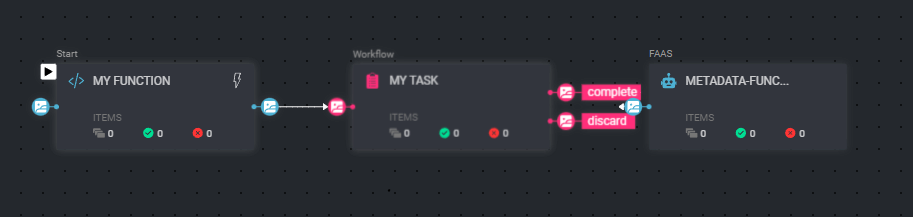

# Example of a simple pipeline

## Description

This example will include a simple pipeline flow generation from the SDK and json template.

The example has the following files:

* [Create & Deploy new pipeline ](create_pipeline.py) - example entry point file (e.g. main)
* [Pipeline template](pipeline_template.json) - the basic template scheme

To run the example, you will need to create a project and a dataset and change the `project_name` and `dataset_name` to those you want to use.

```
project_name = 'My Project'  
dataset_name = 'My Dataset'
```

For this example, we will create service (you can use any existing service), and of-course the pipeline in your project.
If you want to use existing service, set the name in the function, otherwise, you can continue

```
service_name = 'existing-service-name'
```

## Pipeline

Our pipeline will be consisted of the following components:  
* A 'code-block' FaaS - that will be triggered on any new item created in the dataset (you can change its code from the UI).
* A Task - will be created when the first item in the pipeline.
* Service Function - run after item exists from the Task with a status.

Once an item is uploaded, the pipeline will trigger, the code block will be called with the item, and it will set `item.metadata['user']['first'] = 'Hello'`.
After the first node is finished, the item will be added to a task and will be assigned to your user.
Enter the task/assignment item, and press 'Done' to continue with the pipeline.
After status is set on the item, it will continue to the last function that will add `item.metadata['user']['second'] = 'World'` and exit the pipeline.




### Manually Execute 
you can execute the pipeline manually on single and multiple items use  
for single:
```
execution = pipeline.execute(execution_input=dl.FunctionIO(type=dl.PackageInputType.ITEM, value=item.id, name='item'))
```
for multiple:
```
command = pipeline.pipeline_executions.create_batch(
    execution_inputs=dl.FunctionIO(type=dl.PackageInputType.STRING, value='test', name='string'),  # custom input
    filters=filters)
```