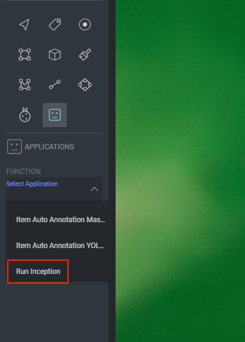

# Model Inference Simple Example

We'll use a simple classification model with tensorflow (version 2.7.0).

## Some Names and Gets

```python
import dtlpy as dl

package_name = 'inceptionv3'
project_name = 'My Project'
src_path = 'functions/model_inference'
project = dl.projects.get(project_name=project_name)

```

## Deploy the Package

We have two functions, one to return the annotations and one to upload them.  
Later, when we'll create a button, we want to return the annotations directly to the Image Studio, so they will be
rendered directly on the image. When using the model inside a pipeline or with a trigger, we want the function to upload
the annotations to image after the inference.

```python
modules = [dl.PackageModule(class_name='ModelRunner',
                            entry_point='main.py',
                            functions=[
                                dl.PackageFunction(
                                    inputs=[dl.FunctionIO(type=dl.PACKAGE_INPUT_TYPE_ITEM, name="item")],
                                    outputs=[dl.FunctionIO(type=dl.PACKAGE_INPUT_TYPE_ANNOTATIONS, name="annotations")],
                                    name='inference',
                                    display_name='InceptionV3',
                                    description='Inference on a pretrained imagenet model'),
                                dl.PackageFunction(
                                    inputs=[dl.FunctionIO(type=dl.PACKAGE_INPUT_TYPE_ITEM, name="item")],
                                    outputs=[dl.FunctionIO(type=dl.PACKAGE_INPUT_TYPE_ITEM, name="item")],
                                    name='inference_and_upload',
                                    display_name='InceptionV3',
                                    description='Inference on a pretrained imagenet model')
                            ])]
package = project.packages.push(package_name=package_name,
                                modules=modules,
                                src_path=src_path)
```

## Deploy the Service

We'll run the inference on a CPU, with a TensorFlow docker image.

```
service = package.services.deploy(service_name=package.name,
                                  runtime=dl.KubernetesRuntime(pod_type=dl.INSTANCE_CATALOG_REGULAR_XS,
                                                               runner_image='tensorflow/tensorflow:2.7.0'))
```

To update an existing service with a new pushed package run the following code:

```
service = package.services.get(service_name=package.name)
service.package_revision = package.version
service.update()
```

## Run an Execution

```
item = dl.items.get(item_id='62c67eef41c7db024a2d7198')
ex = service.execute(function_name='inference_and_upload',
                    execution_input=dl.FunctionIO(type=dl.PackageInputType.ITEM, value=item.id, name='item'))
ex = ex.wait()
ex = dl.executions.get(ex.id)
print(ex.latest_status)
item.open_in_web()               
```

## Set a Button

Now we can create a button in the Item Studio to run the model and return the annotations:

```python
package.slots = [dl.PackageSlot(
    function_name='inference',
    display_name='Run Inception',
    post_action=dl.SlotPostAction(type=dl.SlotPostActionType.DRAW_ANNOTATION),
    display_scopes=[
        dl.SlotDisplayScope(
            resource=dl.SlotDisplayScopeResource.ITEM,
            panel=dl.UI_BINDING_PANEL_STUDIO,
            filters={}
        )])]
package.update()
service.activate_slots(dataset_id='61cab8f601528a3e339c6fc1',
                       project_id=project.id,
                       slots=package.slots)
```

Now we have a button to run this function in the Studio:  


