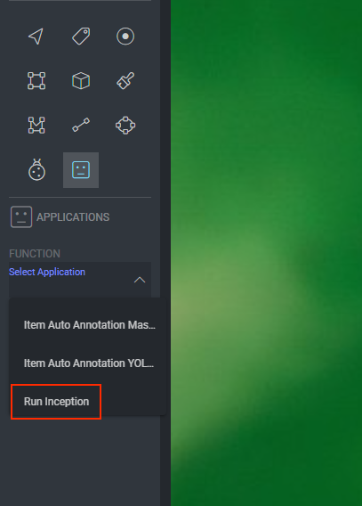

# Model Inference Simple Example

We'll use a simple classification model with tensorflow (version 2.7.0).

## Some Names and Gets

```python
import dtlpy as dl

package_name = 'inceptionv3'
project_name = 'My Project'
src_path = 'functions/model_inference'
project = dl.projects.get(project_name=project_name)

```

## Deploy the app and service

We have two functions: `inference` (return annotations to Image Studio) and `inference_and_upload` (upload annotations when used in a pipeline or trigger). Create a `dataloop.json` manifest in this directory with the module and service (e.g. name `inceptionv3`, runtime with `runnerImage: tensorflow/tensorflow:2.7.0`). Then:

```python
import os
import dtlpy as dl

project_name = 'My Project'
project = dl.projects.get(project_name=project_name)

script_dir = os.path.dirname(os.path.abspath(__file__))
dpk = project.dpks.publish(
    manifest_filepath=os.path.join(script_dir, 'dataloop.json'),
    local_path=script_dir
)
app = project.apps.install(dpk=dpk)

service = project.services.get(service_name='inceptionv3')
```

## Run an Execution

```
item = dl.items.get(item_id='62c67eef41c7db024a2d7198')
ex = service.execute(function_name='inference_and_upload',
                    execution_input=dl.FunctionIO(type=dl.PackageInputType.ITEM, value=item.id, name='item'))
ex = ex.wait()
ex = dl.executions.get(ex.id)
print(ex.latest_status)
item.open_in_web()               
```

## Set a Button

Now we can create a button in the Item Studio to run the model and return the annotations:

```python
package.slots = [dl.PackageSlot(
    function_name='inference',
    display_name='Run Inception',
    post_action=dl.SlotPostAction(type=dl.SlotPostActionType.DRAW_ANNOTATION),
    display_scopes=[
        dl.SlotDisplayScope(
            resource=dl.SlotDisplayScopeResource.ITEM,
            panel=dl.UI_BINDING_PANEL_STUDIO,
            filters={}
        )])]
package.update()
service.activate_slots(dataset_id='61cab8f601528a3e339c6fc1',
                       project_id=project.id,
                       slots=package.slots)
```

Now we have a button to run this function in the Studio:  


