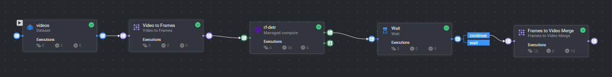
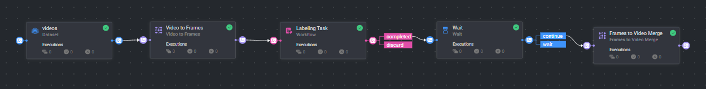

# Video Tracking Tutorial

This notebook provides a comprehensive guide on using video trackers on the Dataloop platform **through the UI** — no SDK or code required. Video tracking is essential for annotating objects across frames in videos, making it faster and more efficient than manual frame-by-frame annotation.

You'll learn about the two types of trackers available in Dataloop:
- **Offline Tracker (ByteTrack):** Links existing annotations across frames in automated pipelines
- **AI Tracker (SAM2):** Generates annotations from a starting point in the Annotation Studio

### Prerequisites:
* **Dataloop Account:** You should have access to a Dataloop platform account.
* **Video Data:** Access to video files for annotation.

### Navigate through the following sections:
1. [Understanding Tracking Modes](#tracking-modes) - Offline Tracker vs AI Tracker
2. [Using the Offline Tracker](#offline-tracker-ui) - ByteTrack in Pipelines
3. [Using the AI Tracker](#ai-tracker-ui) - SAM2 in Annotation Studio
4. [Conclusion and Next Steps](#conclusion)

For more detailed information, refer to the official Dataloop documentation:
- [Video Annotations](https://developers.dataloop.ai/tutorials/annotations/video/chapter)
- [Pipelines Documentation](https://docs.dataloop.ai/docs/pipelines)

## 1. Understanding Tracking Modes

Dataloop offers two distinct tracking approaches, each suited for different use cases. Understanding the difference helps you choose the right tool for your workflow.

### Offline Tracker (Object Association)

The Offline Tracker is designed for **linking existing annotations across frames**. All frames must already be annotated (by running a detection model), and the tracker identifies which annotations represent the same object across different frames.

**How it works:**
1. ALL frames are annotated first (typically by a detection model in a pipeline)
2. Each frame has independent detections (e.g., "person" in frame 1, "person" in frame 2)
3. The Offline Tracker **associates detections** - determining that "person A" in frame X is the same as "person A" in frame X+1
4. The result is a consistent `object_id` assigned to track the same object throughout the video

**Key concept:** The tracker takes MANY independent annotations and LINKS them together by assigning consistent object IDs.

**Implementation:** ByteTrack (used as a pipeline node)

### AI Tracker (Video Propagation)

The AI Tracker (SAM2) is designed for **generating annotations from a single starting point**. You annotate one frame, and the AI propagates that annotation forward through subsequent frames automatically.

**How it works:**
1. You annotate a SINGLE frame with a polygon, brush, or bounding box
2. The AI Tracker (SAM2) uses that annotation as a seed
3. SAM2 **propagates the annotation** forward — predicting the object's position and shape in each subsequent frame
4. The result is a fully annotated sequence with the AI following the object through the video

**Key concept:** The tracker takes ONE annotation and GENERATES many annotations for the rest of the frames.

**Implementation:** SAM2 (used interactively in the Video Studio)

### Comparison Table

| Feature | Offline Tracker | AI Tracker |
|---------|-----------------|------------|
| **Input** | All frames already annotated | Single annotation to start |
| **Output** | Object IDs linking annotations | New annotations in subsequent frames |
| **Purpose** | Associate detections across frames | Generate annotations from one starting point |
| **Implementation** | ByteTrack | SAM2 |
| **Where to use** | Pipeline (automated) | Annotation Studio (interactive) |
| **Correction workflow** | Post-processing review | Fix annotation → Re-track → Regenerate remaining |
| **Typical workflow** | Model detects all frames → Tracker links | Human annotates 1 frame → AI generates rest |

## 2. Using the Offline Tracker (ByteTrack)

The Offline Tracker (ByteTrack) runs as a node in a Dataloop pipeline. Here's how to set it up and use it to link detections across video frames.

### Step 1: Create a Pipeline with Detection + Tracking

The Offline Tracker works as part of a pipeline that processes video frames. A typical pipeline includes:

1. **Video To Frames** - Splits video into individual frames
2. **Detection Model** - Runs object detection on each frame (e.g., RF-DETR, Faster R-CNN)
3. **Wait Node** - Ensures all frames have been processed before proceeding to the next step. This is critical because frame processing happens in parallel, and the Wait Node guarantees that all frames are fully annotated before stitching them back together.
4. **Frames to Video** - Stitches the tracked frames back into an annotated video. This node includes the **ByteTrack** tracker which links detections across frames and assigns consistent object IDs.

#### Example Pipeline with Model Detection:

#### Example Pipeline with Human Annotation:

### Step 2: Add ByteTrack to Your Pipeline

1. Open your project in Dataloop
2. Navigate to **Pipelines** in the left sidebar
3. Create a new pipeline or edit an existing one
4. Add the **Video-Utils** applications, both stitching and splitting from marketplace
5. Install the **Wait Node** application from the marketplace - this ensures all frames are processed before stitching
6. Install a model you want to use

### Step 3: Run the Pipeline

1. Select your video dataset as input
2. Execute the pipeline
3. ByteTrack will process all detected annotations and assign `object_id` to link the same objects across frames
4. View the results in the Video Studio - each object will have a consistent track ID throughout the video

### When to Use Offline Tracker

✅ **Use when:**
- You have a detection model that annotates all frames
- You need to process large video datasets automatically
- You want consistent object IDs for analytics or training
- You're building an automated annotation pipeline

❌ **Don't use when:**
- You want interactive, real-time tracking during annotation
- You only have one frame annotated and want to propagate it
- You need to manually correct tracks during the annotation process

## 3. Using the AI Tracker (SAM2)

The AI Tracker (SAM2) is used in the **Video Studio** to generate annotations from a starting point. Here's how to use it for interactive video annotation.

### Step 1: Open a Video in the Annotation Studio

1. Navigate to your dataset in Dataloop
2. Click on a video item to open it in the Video Studio

### Step 2: Draw Your First Annotation

1. Navigate to the frame where you want to start tracking
2. Select an annotation tool (polygon, brush, bounding box, etc.)
3. Draw an annotation around the object you want to track
4. Make sure the annotation accurately covers the object

### Step 3: Activate the AI Tracker

1. With your annotation selected, choose **AI Tracker** button in the toolbar
2. Click the **Play** button (or use the keyboard shortcut)
3. The AI Tracker (SAM2) will start processing
4. Watch as annotations are automatically generated for subsequent frames

### Step 4: Review Generated Annotations

1. Use the video timeline to scrub through the frames
2. Review each generated annotation to ensure accuracy
3. The AI Tracker maintains the object's shape and position as it moves through the video

<!-- Add image here: Screenshot showing generated annotations on multiple frames -->

### Step 5: Correct and Re-Track (If Needed)

If the AI Tracker made a mistake on a specific frame:

1. **Navigate** to the frame with the incorrect annotation
2. **Edit** the annotation to correct it (resize, reshape, or reposition)
3. **Click Play again** to regenerate annotations for all frames after the corrected frame
4. The AI Tracker will use your corrected annotation as the new starting point

This allows you to iteratively improve tracking results without starting over.

<video controls autoplay muted loop width="100%">
  <source src="data/tracker_tutorial/AI Tracker.mp4" type="video/mp4">
</video>

### When to Use AI Tracker

✅ **Use when:**
- You want to annotate a video interactively
- You have one or a few objects to track
- You need precise detection
- You want human oversight with the ability to correct errors
- You're working on shorter video clips

❌ **Don't use when:**
- All frames are already annotated (use Offline Tracker instead)
- You need fully automated batch processing
- You're processing large video datasets without human review

## 4. Conclusion and Next Steps

Congratulations! You have learned how to use both trackers in the Dataloop platform.

### Summary

| Tracker | Where to Use | When to Use |
|---------|--------------|-------------|
| **Offline Tracker (ByteTrack)** | Pipelines | All frames already annotated, need to link objects |
| **AI Tracker (SAM2)** | Annotation Studio | Start with one annotation, generate the rest |

### Key Takeaways

- **Offline Tracker** links existing annotations - great for automated pipelines
- **AI Tracker** generates new annotations - great for interactive annotation
- You can correct AI Tracker results and re-track at any point
- Choose the right tracker based on your workflow needs

### Additional Resources

- [Video Annotations Tutorial](https://developers.dataloop.ai/tutorials/annotations/video/chapter)
- [Pipelines Documentation](https://docs.dataloop.ai/docs/pipelines)
- [SAM2 GitHub Repository](https://github.com/facebookresearch/segment-anything-2)
- [ByteTrack Paper](https://arxiv.org/abs/2110.06864)

