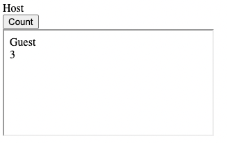

# xFrame

xFrame is a client side only, high performance, simple and lightweight
typescript-based [micro front end framework](https://micro-frontends.org/).
xFrame manages different front-end components, potentially coded with different frameworks, called panels

## Intro

xFrame allows the execution of different typescript/javascript applications in isolated environments. xFrame uses
iframes as containers when maximum isolation is needed.
xFrame defines two types of panels: Host and Guest. A single application will typically contain a single host and many
guests, where the host is trusted (has access to cookies, network APIs) and the guest is un-trusted.

The host and guest are communicating over messages using
the [postMessage Window API method](https://developer.mozilla.org/en-US/docs/Web/API/Window/postMessage).
xFrame defines an [Agent](docs/design.md#agent) for every participating window and allows to create
a [mesh](https://en.wikipedia.org/wiki/Mesh_networking)
topology of agents. The communication between the agents follows the same principles of
the [OSI Model](https://en.wikipedia.org/wiki/OSI_model#:~:text=The%20Open%20Systems%20Interconnection%20model,technology%20and%20specific%20protocol%20suites.).

## Usage example

Each panel in xFrame is identified by its URL, where [CORS](https://developer.mozilla.org/en-US/docs/Web/HTTP/CORS) are
assumed by default, xFrame is client side and does not define where the panels are hosted.
The only requirement from panel is to include the xFrame script and call init():

```html
<script src='https://console.dataloop.ai/dlAppLib.js'></script>
```

Host example:

```html
<html>
<body>
<div>Host</div>
<div id='counter'></div>
<div>
    <button onclick='Count()'>Count</button>
</div>
<script src='https://console.dataloop.ai/dlAppLib.js'></script>
<script>
    dl.init()
    let frame = null
    let frameManager = new FrameManager()

    async function init() {
        frame = await frameManager.createFrameByUrl('./guest.html')
    }

    const Count = () => {
        frame.send('hello')
    }
    init()
</script>
</body>
</html>
```

Guest example:

```html

<html>
<body>
<div>Guest</div>
<div id='counter'></div>
<script src='https://console.dataloop.ai/dlAppLib.js'></script>
<script>
    dl.init()
    let helloCounter = 0

    async function init() {
        await dl.init()
        await dl.on("ready", async () => {
            // xFrame is now available
        })
        dl.on("data", (msg) => {
            if (msg.data === 'hello') {
                helloCounter += 1
                document.getElementById("counter").innerText = helloCounter;
            }
        })
    }

    init()
</script>
</body>
</html>

```

The above example will render as follows:



Learn more:

* [API](./api.md)
* [Design](./design.md)
