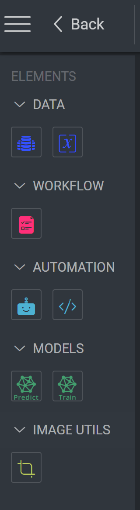
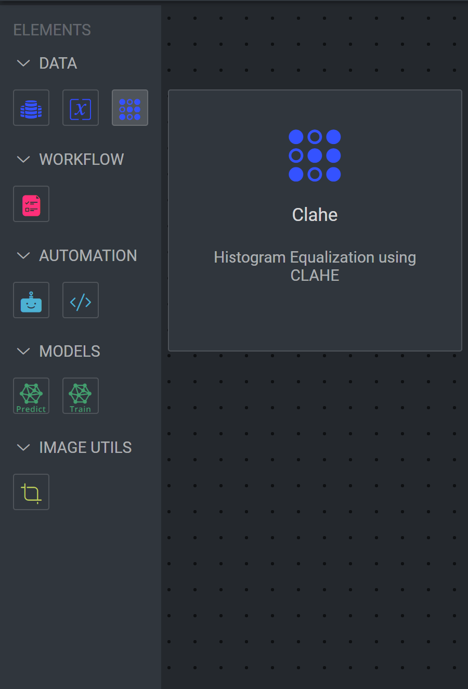

# 🔄 Custom Pipeline Nodes - Extend Your Pipeline Powers!

Welcome to the world of custom pipeline nodes! Here's where you'll learn to extend Dataloop's pipeline capabilities with your own magical nodes. Let's create something amazing! ✨

## 🎯 What are Custom Pipeline Nodes?

The pipeline library is your toolbox of powerful nodes that can be used to build data processing pipelines. While we provide many built-in nodes, you can supercharge your pipelines by adding your own custom nodes!



## 🚀 Creating Your First Custom Node

Let's walk through creating a custom node that applies CLAHE (Contrast Limited Adaptive Histogram Equalization) to images.

### 📜 The Manifest Structure

Your custom node needs a magical manifest (`dataloop.json`) that defines its powers:

```json
{
  "displayName": "Image Clahe",
  "name": "Image Clahe",
  "icon": "icon-dl-qa-sampling",
  "scope": "project",
  "components": {
    "panels": [
      {
        "name": "pipelineNodePanel",
        "icon": "icon-dl-qa-sampling",
        "supportedSlots": [
          {
            "type": "pipelineNodeConfig",
            "configuration": {}
          }
        ]
      }
    ],
    "pipelineNodes": [
      {
        "invoke": {
          "type": "function",
          "namespace": "image-utils.custom_nodes.apply_clahe"
        },
        "categories": ["data"]
      }
    ],
    "modules": [
      {
        "name": "custom_nodes",
        "entryPoint": "modules/main.py",
        "className": "ServiceRunner",
        "functions": [
          {
            "name": "apply_clahe",
            "description": "Histogram Equalization using CLAHE",
            "input": [
              {
                "type": "Item",
                "name": "item"
              }
            ],
            "output": [
              {
                "type": "Item",
                "name": "item"
              }
            ],
            "displayIcon": "qa-sampling",
            "displayName": "Clahe"
          }
        ]
      }
    ]
  }
}
```

### 🐍 The Python Implementation

Create your node's logic in `modules/main.py`:

```python
import dtlpy as dl
import cv2
import numpy as np

class ServiceRunner(dl.BaseServiceRunner):
    def __init__(self):
        """
        Initialize your service runner
        """
        super(ServiceRunner, self).__init__()

    def apply_clahe(self, item: dl.Item):
        """
        Apply CLAHE to enhance image contrast
        """
        # Download the image
        buffer = item.download(save_locally=False)
        bgr = cv2.imdecode(np.frombuffer(buffer.read(), np.uint8), -1)

        # Create CLAHE object
        clahe = cv2.createCLAHE(clipLimit=2.0, tileGridSize=(8,8))

        # Convert to LAB color space
        lab = cv2.cvtColor(bgr, cv2.COLOR_BGR2LAB)
        l, a, b = cv2.split(lab)

        # Apply CLAHE to L channel
        cl = clahe.apply(l)

        # Merge channels
        limg = cv2.merge((cl,a,b))

        # Convert back to BGR
        enhanced = cv2.cvtColor(limg, cv2.COLOR_LAB2BGR)
        # Save the resulting image
        output_path = os.path.join(os.getcwd(), f'clahe_{item.name}')
        cv2.imwrite(output_path, equalized_image)
        new_item = item.dataset.items.upload(local_path=output_path, remote_path=item.dir)

        return new_item
```

### ⚙️ Service Configuration

The service settings in your manifest control how your node runs:

```json
"components": {
    "services": [
    {
      "name": "image-utils",
      "panelNames": ["pipelineNodePanel"],
      "moduleName": "custom_nodes",
      "runtime": {
      "podType": "regular-xs",
      "runnerImage": "dataloopai/dtlpy-agent:cpu.py3.8.opencv4.7",
      "concurrency": 10,
      "autoscaler": {
        "type": "rabbitmq",
        "minReplicas": 1,
        "maxReplicas": 2,
        "queueLength": 10
      },
      "executionTimeout": 3600
    },
    "maxAttempts": 3
  }
]
}
```

## 🎮 Using Your Custom Node

1. **Install the Node**

   - Follow our [Custom Pipeline nodes Demo](https://github.com/dataloop-ai-apps/custom-pipeline-nodes-demo)
   - Your node will appear in the pipeline library

2. **Add to Pipeline**
   - Drag and drop your node into your pipeline
   - Configure any parameters
   - Connect inputs and outputs



## 💡 Pro Tips

- 🔧 Keep your node focused on one task
- 📊 Add proper error handling
- 🎨 Choose meaningful icons
- 📝 Write clear descriptions
- ⚡ Optimize for performance

## 🎨 Creating Pipeline Templates

Want to share your pipeline magic with others? Let's create a reusable pipeline template! Here's an example of an image augmentation pipeline that automatically processes images with various transformations.

### 📜 Pipeline Template Manifest

Your pipeline template needs its own magical manifest (`dataloop.json`):
By adding a pipeline template to the project, the template will be available to all users in the project. pipeline template to the DPK, the template will be available to all users in the project. Just install the app and use the template in the pipeline.

```json
{
  "name": "image-augmentation-pipeline",
"components": {
  "pipelineTemplates": [
   ...
  ]
}
}
```

Check all of our [Pipeline Templates](https://github.com/dataloop-ai-apps/pipeline-templates) for more information.

### 🚀 Using the Template

1. **Install the Template**

Navigate to the marketplace and install the template.
The new pipeline will be available in the project.

2. **Execute the Pipeline**

```python
# Create a new pipeline from the template
pipeline = project.pipelines.get(name='my-augmentation-pipeline')
# Start the pipeline
pipeline.execute(items=[item1, item2])
```

### 💡 Template Pro Tips

- 🎯 Make your template focused and purpose-driven
- 📝 Provide clear node configurations
- ⚡ Optimize for parallel processing when possible
- 📊 Consider resource requirements

## 🚀 Next Steps

Ready to create your own pipeline node? Here's your checklist:

1. 📝 Define your node's purpose
2. 🎨 Design the interface
3. 🔧 Implement the logic
4. 📦 Package it up
5. 🧪 Test thoroughly
6. 🚀 Share with your team!

Need inspiration? Check out our [example nodes](https://github.com/dataloop-ai-apps/custom-pipeline-nodes-demo) or join our developer community! ✨
