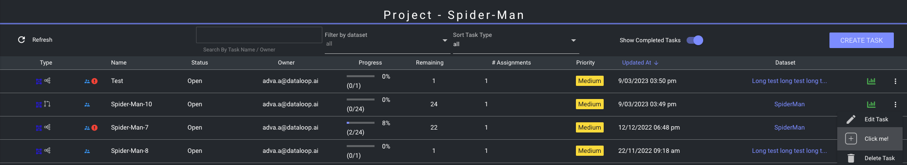

# UI Toolbars
* Toolbars are a collection of buttons or icons that represent specific actions or features. These buttons are dynamically generated based on the context and available applications.

## When are we going to need toolbars?
* When we have a **function** that we would like to execute from a button rendered in the platform
* When we have a **panel** (UI Application) that we would like to open from a button rendered in the platform

## The current available toolbar locations in the platform
* `datasetsDashboard` - Currently available in both the *Datasets*  and *Project Overview* pages. 
* `datasetBrowser` - *Not available for regular users yet* 
* `datasetMenu` - Currently available in the dataset menu in both the *Datasets*  and *Project Overview* pages. 
* `taskMenu` - Available in the task menu in the *Tasks* page. 
* `itemMenu` - Available in the right-click item menu in the *Dataset Browser*. 
* `projectActions` - Available in the Project Actions menu in the *Project Overview* page. 

## Toolbar Structure in a DPK/App entity
```typescript
interface Toolbar {
    displayName: string  // The text that will be rendered in the button - for example: 'Click me!'
    conditions?: {  // DQL filter options
        resources: [
            {
                entityType: string  // Dataloop Entity to run the DQL on - dataset, task, project, etc.
                filter?: Dictionary  // DQL filter
            }
        ]
    }
    invoke: {
        type: 'panel' | 'function'
        namespace: string  // serviceName.moduleName.functionName || panelName
        inputOptions?: Dictionary  // Additional inputs - { key: value }
    }
    location?:  // when not mentioned - shows up everywhere!
        'datasetsDashboard' |
        'datasetBrowser' |
        'datasetMenu' |
        'taskMenu' |
        'itemMenu' |
        'projectActions'
    icon?: string  // the icon that will be rendered in the button - for example: 'icon-dl-add'
}
```
* Possible icons: https://dataloop-ai.github.io/icons/

## Toolbar Examples in a DPK/App entity
```json
{
  "toolbars": [
    {
      "displayName": "Open Panel",  // toolbar display name
      "invoke": {  // invoke options
        "type": "panel",
        "namespace": "myPanel"  // name of the panel
      },
      "icon": "icon-dl-add",
      "location": "datasetsDashboard",  // slot location
      "conditions": {  // DQL filter options
        "resources": []
      }
    },
    {
      "displayName": "Run Function", // toolbar display name
      "invoke": {  // invoke options
        "type": "function",
        "namespace": "moduleName.functionName"
      },
      "icon": "icon-dl-edit",
      "location": "datasetMenu",  // slot location
      "conditions": {  // DQL filter options
        "resources": [
          {
            "entityType": "dataset",
            "filter": {
              "$and": [
                {
                  "metadata": {
                    "myField": "helloWorld"
                  }
                }
              ]
            }
          }
        ]
      }
    }
  ]
}
```
