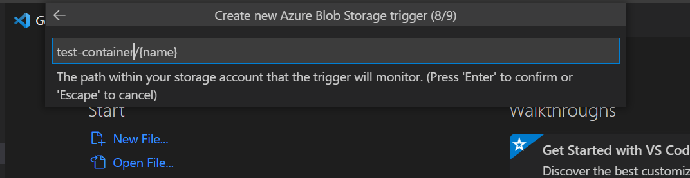

## Dataset Binding with Azure  
  
We will create an Azure Function App to continuously sync a blob with Dataloop's dataset  
  
If you want to catch events from the Azure blob and update the Dataloop Dataset you need to set up a blob function.  
The function will catch the blob storage events and will reflect them into the Dataloop Platform.  
  
If you are familiar with [Azure Function App](https://learn.microsoft.com/en-us/azure/azure-functions/create-first-function-vs-code-python), you can just use our integration function below.  
  
We assume you already have an Azure account with resource group and storage account. If you don't, follow the [Azure docs](https://learn.microsoft.com/en-us/azure/storage/common/storage-account-create) and create them.  
  
### Create the Blob Function  
1. Create a Container in the created Storage account  
   * Public access level -> Container OR Blob  
NOTE this container should be used as the external storage for the Dataloop dataset.  
2. Go back to Resource group and click Create -> Function App  
   * Choose Subscription, your Resource group, Name and Region  
   * Publish -> Code  
   * Runtime stack -> Python  
   * Version -> <=3.7  
  
In VScode, flow the instructions in [azure docs](https://learn.microsoft.com/en-us/azure/azure-functions/create-first-function-vs-code-python) to configure your environment and deploy the function:  
1. Configure your environment  
2. Sign in to Azure  
3. Create your local project  
   * in Select a template for your project's first function choose -> Azure Blob Storage trigger  
   * in Storage account select your Storage account  
   * in Resource group select your Resource group  
   * Set the 'Create new Azure Blob Storage trigger' to your container name (used in the Dataloop platform)  
      
   * open the code file  
   * add dtlpy to the requirements.txt file  
   * add **"disabled": false** to the function.json file  
   * add a function code to \_\_init\_\_.py file  
  

```python
import azure.functions as func
import dtlpy as dl
import os
os.environ["DATALOOP_PATH"] = "/tmp"
dataset_id = os.environ.get('DATASET_ID')
dtlpy_username = os.environ.get('DTLPY_USERNAME')
dtlpy_password = os.environ.get('DTLPY_PASSWORD')
def main(myblob: func.InputStream):
    dl.login_m2m(email=dtlpy_username, password=dtlpy_password)
    dataset = dl.datasets.get(dataset_id=dataset_id,
                              fetch=False  # to avoid GET the dataset each time
                              )
    # remove th Container name from the path
    path_parser = myblob.name.split('/')
    file_name = '/'.join(path_parser[1:])
    file_name = 'external://' + file_name
    dataset.items.upload(local_path=file_name)
```
4. Deploy the code to the function app you created.  
5. In VS code go to view tab -> Command Palette -> Azure Functions: Upload Local Settings  
6. Go to the Function App -> Select your function -> Configuration (Under Settings section)  
       * add the 3 secrets vars DATASET_ID, DTLPY_USERNAME, DTLPY_PASSWORD  
  
**Done! Now your storage blob will be synced with the Dataloop dataset**  
