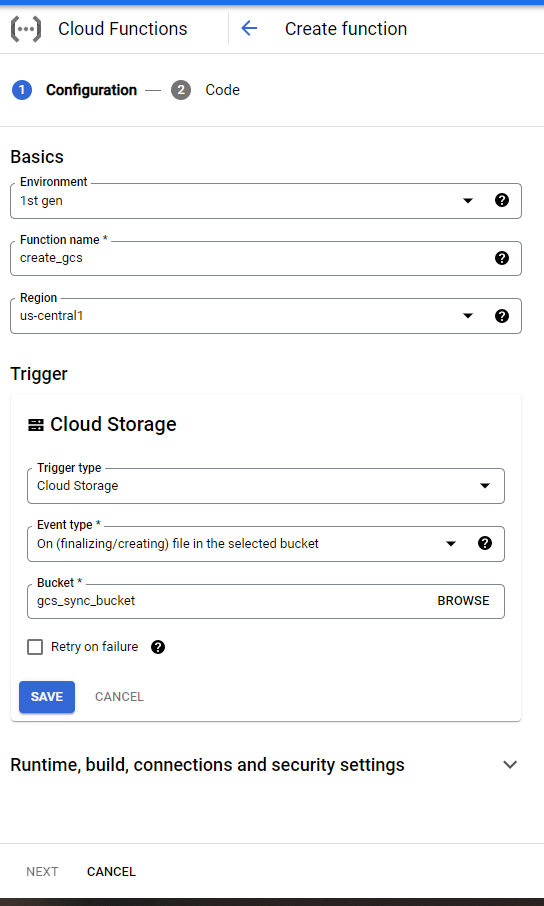

## Create an GCS cloud function to Continuously Sync a Bucket with Dataloop's Dataset  
  
If you want to catch events from the GCS bucket and update the Dataloop Dataset you need to set up a Cloud function.  
The function will catch the GCS bucket events and will reflect them into the Dataloop Platform.  
  
### Create the cloud function  
1. Create a cloud function for create event (must add the environment variables DATASET_ID, DTLPY_USERNAME and DTLPY_PASSWORD)  
  
  
  
2. add dtlpy to the requirements.txt  
3. Copy the following code to the main file:  

```python
import dtlpy as dl
import os
dataset_id = os.environ.get('DATASET_ID')
dtlpy_username = os.environ.get('DTLPY_USERNAME')
dtlpy_password = os.environ.get('DTLPY_PASSWORD')
def create_gcs(event, context):
    """Triggered by a change to a Cloud Storage bucket.
    Args:
         event (dict): Event payload.
         context (google.cloud.functions.Context): Metadata for the event.
    """
    file = event
    dl.login_m2m(email=dtlpy_username, password=dtlpy_password)
    dataset = dl.datasets.get(dataset_id=dataset_id,
                              fetch=False  # to avoid GET the dataset each time
                              )
    file_name = 'external://' + file['name']
    dataset.items.upload(local_path=file_name)
```
4. create another function for delete with delete event with this code  

```python
import dtlpy as dl
import os
dataset_id = os.environ.get('DATASET_ID')
dtlpy_username = os.environ.get('DTLPY_USERNAME')
dtlpy_password = os.environ.get('DTLPY_PASSWORD')
def delete_gcs(event, context):
    """Triggered by a change to a Cloud Storage bucket.
    Args:
         event (dict): Event payload.
         context (google.cloud.functions.Context): Metadata for the event.
    """
    file = event
    dl.login_m2m(email=dtlpy_username, password=dtlpy_password)
    dataset = dl.datasets.get(dataset_id=dataset_id,
                              fetch=False  # to avoid GET the dataset each time
                              )
    file_name = file['name']
    dataset.items.delete(filename=file_name)
```
Deploy and you're good to go!  
