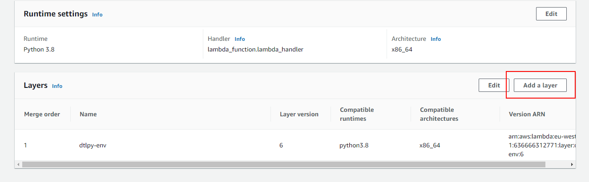

# Create an AWS Lambda to Continuously Sync a Bucket with Dataloop's Dataset  
  
If you want to catch events from the AWS bucket and update the Dataloop Dataset you need to set up a Lambda.  
The Lambda will catch the AWS bucket events and will reflect them into the Dataloop Platform.  
  
We created the environment zip file with our SDK for python3.8. For other version or more packages try creating your own layer.  
(We used [this](https://www.geeksforgeeks.org/how-to-install-python-packages-for-aws-lambda-layers) tutorial and the python:3.8 docker image)  
  
# Create the Lambda  
  
Create a new Lambda and copy the following code:  
  

```python
import os
import urllib.parse
# Set dataloop path to tmp (to read/write from the lambda)
os.environ["DATALOOP_PATH"] = "/tmp"
import dtlpy as dl
DATASET_ID = ''
DTLPY_USERNAME = ''
DTLPY_PASSWORD = ''
def lambda_handler(event, context):
    dl.login_m2m(email=DTLPY_USERNAME, password=DTLPY_PASSWORD)
    dataset = dl.datasets.get(dataset_id=DATASET_ID,
                              fetch=False  # to avoid GET the dataset each time
                              )
    for record in event['Records']:
        # Get the bucket name
        bucket = record['s3']['bucket']['name']
        # Get the file name
        filename = urllib.parse.unquote_plus(record['s3']['object']['key'], encoding='utf-8')
        if 'ObjectRemoved' in record['eventName']:
            # On delete event - delete the item from Dataloop
            try:
                dtlpy_filename = '/' + filename
                filters = dl.Filters(field='filename', values=dtlpy_filename)
                dataset.items.delete(filters=filters)
            except Exception as e:
                raise e
        elif 'ObjectCreated' in record['eventName']:
            # On create event - add a new item to the Dataset
            try:
                # upload the file
                path = 'external://' + filename
                # dataset.items.upload(local_path=path, overwrite=True) # if overwrite is required
                dataset.items.upload(local_path=path)
            except Exception as e:
                raise e
```
## Add a Layer to the Lambda  
We have created an AWS Layer with the Dataloop SDK ready.  
After creating the lambda, select the "Add Layer" and upload the zip file downloaded from [here](https://storage.googleapis.com/dtlpy/aws-python3.8-lambda-layer/layer.zip)  
  
  
  
## Create the Bucket Events  
Go to the bucket you are using, and create the event:  
1. Go to Properties → Event notifications → Create event notification  
1. Choose a name for the Event  
1. For Event types choose: All object create events, All object delete events  
1. Destination - Lambda function → Choose from your Lambda functions → choose the function you build → SAVE  
  
Deploy and you're good to go!  
