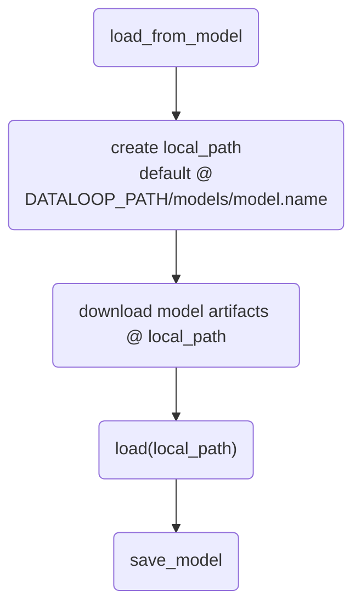
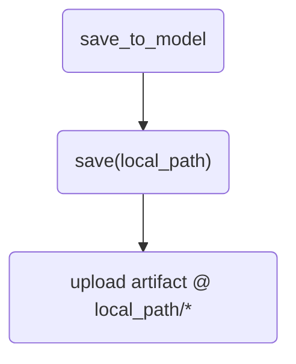
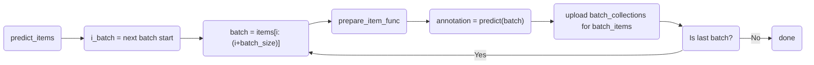
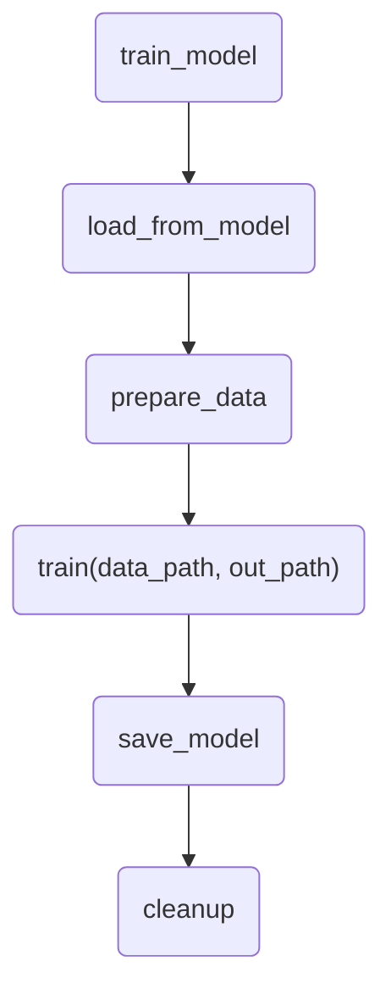
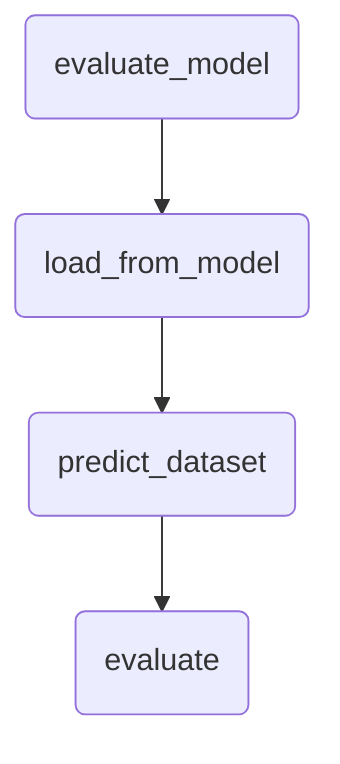

# Wrappers Functions

## `load_from_model`


```shell
Directory tree at this stage:
DATALOOP_PATH
|-- models
|   |-- model.name
|      |-- artifacts
```
## `save_to_model`

## `prdict_items`



## `train_model`

When running a training session from the model adapter, we start by calling the `train_model` wrapper function



```shell
Directory tree at convert_from_dtlpy (supposing train and validation subsets):
-- DATALOOP_PATH
   |-- models
   |   |-- model.name
   |      |-- artifacts
   |-- model_data
       |-- model.id_model.name
           |-- timestamp (root_path)
               |-- output (out_path)
               |-- datasets
                   |-- dataset.id (data_path)
                       |-- train
                       |   |-- items
                       |   |   |-- train_dir (from filter)
                       |   |-- json
                       |       |-- train_dir (from filter)
                       |-- validation
                           |-- items
                           |   |-- val_dir (from filter)
                           |-- json
                               |-- val_dir (from filter)

```
# `evaludate_model`


# User Function

## `load`
After the wrapper function download all the model artifact to the local directory, users must implement this function to load the model (using the local files and the model config) and instantiate the model.

## `save`
Users need to implement this function to dump the model state to a local directory, e.g. `torch.save(model.state_dict(), PATH)`
After that, the wrapper function will take care of the rest and will upload the files into the platform, update the model config, and save everything on to the model entity

## `train`
This function is called the wrapper function loads the model, downloads and prepare the data.
Now everything is ready locally and this function implements the actual model training.
When this is done, there's no need to do anything - the wrapper will take care of the saving and uploading.

## `predict`
This function is called the load model, so now we have the model ready to predict.
Each item goes through the `prepare_item_func` and a batch is ready to predict.
After the model prediction, user will need to prepare the annotation is the Dataloop format using the DL annotations.

## `prepare_item_func`
Prepares each item for prediction. Bt default, images will be downloaded and loaded into a ndarray as a batch (NHWC)
