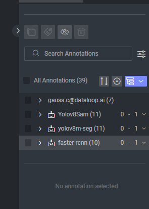

# Model Annotations

## Add

Adding model metadata to annotations will help filter for model annotations in the studios, using a DQL, and more.
Add the model information to the annotation like this:

```python
detections = model.predict(image)
collection = item.anntoationds.builder()

for detection in detections:
    x1, y1, x2, y2, label_ind, confidence = detection
    collection.add(annotation_definition=dl.Box(left=x1,
                                                top=y1,
                                                right=x2,
                                                bottom=y2,
                                                label=model_entity.id_to_label_map[label_ind]
                                                ),
                   model_info={'name': model_entity.name,
                               'model_id': model_entity.id,
                               'confidence': float(confidence)})
item.annotations.upload(collection)
```

This will add the information to the `annotation.metadata.user.model`.
## Filter

In the studio, you can group annotation by creator to see each model's annotations:

Using the SDK you can query and get only the models annotations:




```python
import dtlpy as dl

dl.setenv('prod')
dataset = dl.datasets.get(dataset_id='')
model = dl.models.sget(model_id='')

filters = dl.Filters(resource=dl.FILTERS_RESOURCE_ANNOTATION)
filters.add(field='metadata.user.model.name', values=model.name)

# list to get the number
pages = dataset.annotations.list(filters=filters)
print(f'dataset has {pages.items_count} annotations from the model')
```

## Delete

**WARNING** This script will **delete annotations** from the entire dataset! make sure you delete what you want. There's no
way to restore deleted annotations!!

```python
import dtlpy as dl

dl.setenv('prod')
dataset = dl.datasets.get(dataset_id='')
model = dl.models.sget(model_id='')

filters = dl.Filters(resource=dl.FILTERS_RESOURCE_ANNOTATION)
filters.add(field='metadata.user.model.name', values=model.name)

# list to get the number
pages = dataset.annotations.list(filters=filters)
print(f'dataset has {pages.items_count} annotations from the model')

# bulk delete using a DQL
dataset.annotations.delete(filters=filters)

```
