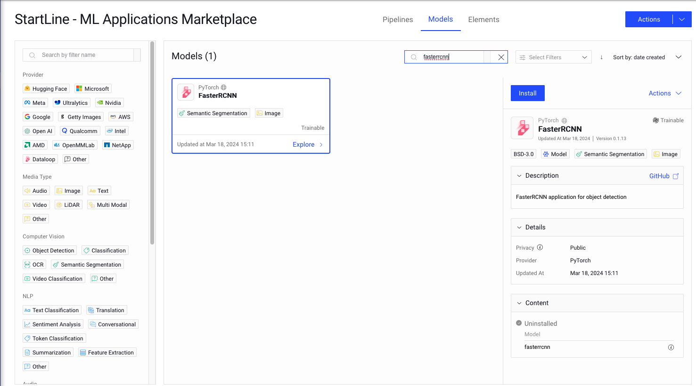

## Create your own model  
  
You can use your own model to use on the platform by creating an App and Model entities, and then use a model adapter to create an API with Dataloop.  
  
In this tutorial you will learn how to create a basic model adapter to be able to inference on platform items.  
  
### Create a model adapter  
  
In the example code below, the adapter is defined in a script saved as `adapter.py`. The SimpleModelAdapter class inherits from `dl.BaseModelAdapter`, which contains  
all the Dataloop methods required to interact with the App and Model, as well as some internal wrapper functions that make it easier to use Dataloop entities (e.g. `predict_items`, `predict_datasets`).  
  
The minimum required functions to implement for a model to inference are `load` and `predict`.  
  
`load` is supposed to implement loading the model (e.g. from any weights.pth). The `load` takes a local path as input.  
  
In the `dl.BaseModelAdapter` we have a `load_from_model` wrapper which will download the model artifacts locally and call the custom `load` with the path containing all the files.  
  
`predict` is where the model will do its inference, and the predict function expects a preprocessed batch (e.g. ndarray for images), and returns a list of dl.AnnotationCollection entities.  
  
The wrapper for `predict` is `predict_items`, which takes a list of items from the platform and prepares everything for predicting. It uses the `prepare_item_func` to preprocess items into the a batch and calles the custom `predict`. After the prediction, it takes the ouput and uploads it to each item.  
  
NOTE: You can edit the preprocess function by simply override the `prepare_item_func` method. For example, to pass the items as-is you can just return the inputted item.  
  
in `adapter.py`, add the following model adapter:  

```python
import dtlpy as dl
import torch
import os
@dl.Package.decorators.module(name='model-adapter',
                              description='Model Adapter for my model',
                              init_inputs={'model_entity': dl.Model})
class SimpleModelAdapter(dl.BaseModelAdapter):
    def load(self, local_path, **kwargs):
        print('loading a model')
        self.model = torch.load(os.path.join(local_path, 'model.pth'))
    def predict(self, batch, **kwargs):
        print('predicting batch of size: {}'.format(len(batch)))
        preds = self.model(batch)
        batch_annotations = list()
        for i_img, predicted_class in enumerate(preds):  # annotations per image
            image_annotations = dl.AnnotationCollection()
            # in this example, we will assume preds is a label for a classification model
            image_annotations.add(annotation_definition=dl.Classification(label=predicted_class),
                                  model_info={'name': self.model_name})
            batch_annotations.append(image_annotations)
        return batch_annotations
```
Please see an example [here](https://github.com/dataloop-ai-apps/torch-models/blob/main/adapters/resnet/resnet_adapter.py) (for PyTroch's Resnet) in Github of a working model adapter and see how to construct Annotation Collections.  
  
### Publish the App  
  
In order to create the app for publishing, installing and using the model created from the Model Adapter, a DPK Manifest is required.  
For more information regarding our apps please see the Applications chapter [here] (https://developers.dataloop.ai/tutorials/applications/).  
  
A Dataloop Manifest example:  
``` json  
    {  
    "name": "<your app name>",  
    "displayName": "<the app display name>",  
    "version": "<current version>",  
    "scope": "project",  
    "description": "",  
    "codebase": {  
        "type": "git",  
        "gitUrl": "<your-url>",  
        "gitTag": ""  
    },  
    "components": {  
        "computeConfigs": [  
            {  
                "name": "<service-name>",  
                "runtime": {  
                    "podType": "regular-xs",  
                    "concurrency": 1,  
                    "autoscaler": {  
                        "type": "rabbitmq",  
                        "minReplicas": 0,  
                        "maxReplicas": 2,  
                        "queueLength": 100  
                    }  
                }  
            }  
        ],  
        "modules": [  
            {  
                "name": "<module-name>",  
                "entryPoint": "model_adapter.py",  
                "className": "Adapter",  
                "computeConfig": "<service-name>",  
                "description": "",  
                "initInputs": [  
                    {  
                        "type": "Model",  
                        "name": "model_entity"  
                    }  
                ],  
                "functions": [  
                    {  
                        "name": "evaluate_model",  
                        "input": [  
                            {  
                                "type": "Model",  
                                "name": "model",  
                                "description": "Dataloop Model Entity"  
                            },  
                            {  
                                "type": "Dataset",  
                                "name": "dataset",  
                                "description": "Dataloop Dataset Entity"  
                            }  
                        ],  
                        "output": [  
                            {  
                                "type": "Model",  
                                "name": "model",  
                                "description": "Dataloop Model Entity"  
                            },  
                            {  
                                "type": "Dataset",  
                                "name": "dataset",  
                                "description": "Dataloop Dataset Entity"  
                            }  
                        ],  
                        "displayName": "Evaluate a Model",  
                        "displayIcon": "",  
                        "description": "Function to evaluate model performance"  
                    },  
                    {  
                        "name": "predict_items",  
                        "input": [  
                            {  
                                "type": "Item[]",  
                                "name": "items",  
                                "description": "List of items to run inference on"  
                            }  
                        ],  
                        "output": [  
                            {  
                                "type": "Item[]",  
                                "name": "items",  
                                "description": "The same input images for prediction."  
                            },  
                            {  
                                "type": "Annotation[]",  
                                "name": "annotations",  
                                "description": "The predicted annotations."  
                            }  
                        ],  
                        "displayName": "Predict Items",  
                        "displayIcon": "",  
                        "description": "Function to run inference on items"  
                    },  
                    {  
                        "name": "predict_dataset",  
                        "input": [  
                            {  
                                "type": "Dataset",  
                                "name": "dataset",  
                                "description": ""  
                            },  
                            {  
                                "type": "Json",  
                                "name": "filters",  
                                "description": "Dataloop Filter DQL"  
                            }  
                        ],  
                        "output": [],  
                        "displayName": "Predict Dataset",  
                        "displayIcon": "",  
                        "description": "Function to run inference on a dataset."  
                    },  
                    {  
                        "name": "train_model",  
                        "input": [  
                            {  
                                "type": "Model",  
                                "name": "model",  
                                "description": "Dataloop Model Entity"  
                            }  
                        ],  
                        "output": [  
                            {  
                                "type": "Model",  
                                "name": "model",  
                                "description": "Dataloop Model Entity"  
                            }  
                        ],  
                        "displayName": "Train a Model",  
                        "displayIcon": "",  
                        "description": "Function to train model"  
                    },  
                    {  
                        "name": "predict_dataset",  
                        "input": [  
                            {  
                                "type": "Dataset",  
                                "name": "dataset",  
                                "description": ""  
                            },  
                            {  
                                "type": "Json",  
                                "name": "filters",  
                                "description": "Dataloop Filter DQL"  
                            }  
                        ],  
                        "output": [],  
                        "displayName": "Predict Items",  
                        "displayIcon": "",  
                        "description": "Function to run inference on a whole dataset"  
                    }  
                ]  
            }  
        ],  
        "models": [  
             {  
                "name": "<model name>",  
                "moduleName": "<module name>",  
                "scope": "project",  
                "status": "pre-trained",  
                "configuration": {  
                    "weights_filename": "<weights file name>",  
                    "epochs": 10,  
                    "batch_size": 4,  
                    "imgsz": 640,  
                    "conf_thres": 0.25,  
                    "iou_thres": 0.45,  
                    "max_det": 1000  
                },  
                "inputType": "image",  
                "outputType": "box",  
                "description": "",  
                "labels": [< a list of your pre-trained labels>]  
            }  
        ]  
    }  
}  
```  
  
To change the service configurations, see the documentation on [service types](https://dataloop.ai/docs/service-runtime).  
  
Then we can publish and install the app in our project.  
  
 ```bash  
dlp app publish --project-name "<your project name>"  
```  
  
To install the app from the UI, find the published app in the Models Marketplace and click Install:  
  
  
  
 To install from the SDK, running the following lines with python from the directory where the manifest is located:  
  

```python
project = dl.projects.get(project_name="<your-project-name>")
dpk = dl.dpks.get(dpk_name='<app-name>')
project.apps.install(dpk=dpk)
```
### Get the model and upload artifacts  
  
Now you can get the model created by installing the app and upload pretrained model weights with an Artifact Item.  
Here, the weights will be uploaded as an Item Artifact connected to the model.  
You can upload any weights file here and use the artifact filename to update the `weights_filename` field in the model configuration (in the manifest).  
  
  

```python
project = dl.projects.get(project_name="<your-project-name>")
model = project.models.get("<model-name>")  # From the manifest's models.name
artifact = model.artifacts.upload(filepath='/path/to/model_weights.pth')
model.configuration['weights_filename'] = artifact.filename
# to deploy the model
model.deploy()
```
## Checking that your model works  
  
NOTE: The deployed service must be up and ready in order to run the predictions (including in the test tab). You can check the status of the deployed service in the services page.  
  
### Via the UI  
  
You should now be able to see the model in the “Deployed” tab. After clicking on your model, you should see a “Test” tab where you can drag and drop an image, click “Test” and see the results of your model prediction.  
  
If you get timeouts or error predicting, check that the service is up and is functioning as expected.  
  
  
  
### Via the SDK  
  
To test whether your function was successfully uploaded and deployed onto the platform, you can use the `model.predict()` function to predict on a list of item IDs.  
The function will return an Execution entity, which you can use to check the status of the prediction execution.  
Once the execution is completed, the annotation will be uploaded to each item.  

```python
model = dl.models.get(model_id='<model_id>')
item = dl.items.get(model_id='<item_id>')
execution = model.predict(item_ids=[item.id])
# wait for the execution to complete and get an updated execution
execution.wait()
execution = dl.executions.get(execution_id=execution.id)
# print the most recent status
print(execution.status[-1]['status'])
```
  
If you encounter errors, you will need to look at the logs to see where the error occurred.  Go to "Model Management", under the "Deployed" tab, click on the number in the "Executions" column for the appropriate model, and then click on the "Execution" log icon on the right side of the screen (the paper icon). Here you can see the output of the cloud machine. You can also access this page via the "Application Hub", under "Executions".  
