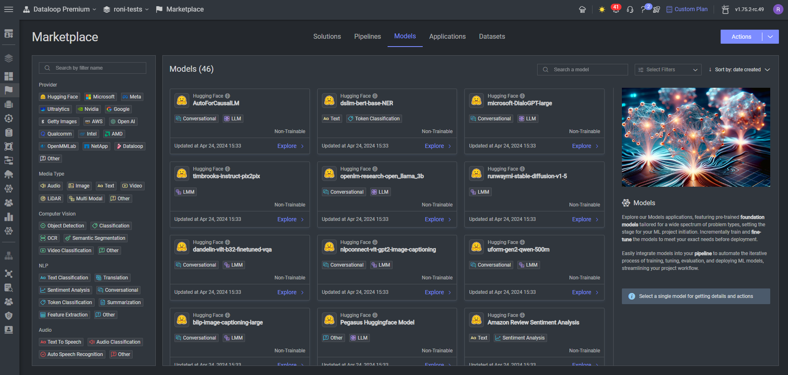

# Models from the Marketplace  
  
Ready-to-use models are available in Dataloop Marketplace.  
  
The Marketplace contains various algorithms and pretrained models that can be used for inference or fine-tuning via additional training on your custom datasets.  
  
This tutorial will cover how to use Marketplace models apps for:  
  
- Predicting from pretrained models.  
- Fine-tuning training on a custom dataset.  
  
For More information on the using the models in the UI:  
  
- [Marketplace Models](https://dataloop.ai/docs/startline-models)  
- [Model Management Overview](https://dataloop.ai/docs/model-management-overview)  
## Predicting  
  
### Install and deploy a model  
  
First we'll create a new project and dataset, and upload a new item:  
  

```python
project = dl.projects.create(project_name = "<project-name>")
dataset = project.datasets.create(dataset_name ="<dataset-name>")
item = dataset.items.upload(
    'https://github.com/dataloop-ai/dtlpy-documentation/blob/f63d2c6ccefbde90255d7a00bdf9cda45f24cb6f/assets/images/hamster.jpg?raw=true')
```
Then, we can go to Marketplace and choose a global model to install from the Models tab:  
  
  
After installing the public app, we can use the model in our project.  
  
Only models that are trained (i.e. model.status = 'trained') can be deployed. Models from Marketplace can be deployed directly.  
  
Note:   1. The model created by installing the app can be found in "Models" section.  
        2.You can add any service configuration to override the default on the deployed service.  

```python
model = project.models.get(model_name ="<model-name>")
service = model.deploy(service_config={'runtime': {"podType": dl.INSTANCE_CATALOG_REGULAR_S}})
```
  
### Predict items  
  
Once a model is deployed, you can predict on items using the `model.predict()` function.  
The function returns an execution object that can be used to track whether the prediction execution was successful.  
If successful, the annotations will be uploaded to the item directly and can be viewed in the annotation studio.  
  
If you have just deployed the model, `get` the model again to get the updated model metadata that includes the deployment information.  
  

```python
model = dl.models.get(model_id=model.id)
ex = model.predict(item_ids=[item.id])
ex.wait()
item.open_in_web()
```
  
## Finetune on a custom dataset  
  
If you would like to customize the marketplace model (for transfer-learning or fine-tuning), you can indicate the new dataset and labels you want to use for model training.  
  
### Define dataset subsets  
(train/validation split) of the dataset for the training session.  
To avoid data leakage between training sessions and to make each training reproducible, we will define the data subsets and save the split type to the model entity (using a DQL). Using DQL filters you can subset the data however you like.  
  
For example, if your dataset is split between folders, you can use this DQL to add metadata for all items in the dataset  

```python
train_filter = dl.Filters(field='dir', values='/train')
validation_filter = dl.Filters(field='dir', values='/validation')
custom_model = project.models.clone(from_model=public_model,
                                    model_name='finetuning_mode',
                                    dataset=dataset,
                                    project_id=project.id,
                                    train_filter=train_filter,
                                    validation_filter=validation_filter)
```
This way, when the training starts, the sets will be downloaded using the DQL and any future training session on this dataset will have the same subsets of data.  
  
**NOTE**: In the future, this mechanism will be expanded to use a tagging system on items. This will allow more flexible data subsets and random data allocation.  
  
**HINT**: Check out [this example](https://github.com/dataloop-ai/dtlpy-documentation/blob/main/examples/items/random_split_to_folders.py) to move items randomly and quickly!  
  
### Labels Mapping  
We have two properties on the model:  
  
```python  
custom_model.id_to_label_map  
custom_model.label_to_id_map  
```  
  
Models usually convert the string labels into some int ids. We save this mapping in the `model.configuration` in order to get the same labels convertion before and after training.  
This mapping is required to convert the numbers to a label that is recognized in the dataset recipe.  
  
### Model Configuration  
The configuration (for predict, train, and general model parameters) are saved in a dictionary on the mode:  
  
```python  
custom_model.configuration  
```  
  
The different parameters and their use and different for each mode and depend on the model adapter implementation.  
Print and check what you can add or edit, go to the model git or docs for more options (WIP)  
  
## Train  
  
To train the model on your custom data, simply use the `model.train()` function and wait for the training to finish. You can monitor the training progress on the platform or via the python SDK. To see the updated model status, retrieve the model again from the platform.  
  

```python
ex = custom_model.train(service_config={'runtime': {"podType": dl.INSTANCE_CATALOG_REGULAR_S}})
# Or with a full service config:
ex = custom_model.train(service_config={
    'runtime': dl.KubernetesRuntime(pod_type=dl.INSTANCE_CATALOG_GPU_K80_S,
                                    autoscaler=dl.KubernetesRabbitmqAutoscaler(
                                        min_replicas=0,
                                        max_replicas=1),
                                    preemptible=False,
                                    concurrency=1).to_json(),
    'executionTimeout': 10000 * 3600
})
ex.logs(follow=True)  # to stream the logs during training
custom_model = dl.models.get(model_id=custom_model.id)
print(custom_model.status)
```
## Deploy the new model  
  
Once the model is trained, it can be deployed as a service. The `model.deploy()` function automatically creates a bot and service for the trained model.  
  
Once you have a model deployed, you can create a UI slot to inference on individual data items on the platform, or call the model to inference in a FaaS or pipelines.  
  

```python
custom_model.deploy()
custom_model = dl.models.get(model_id=custom_model.id)  # to get new information on the deployed service
model.predict(item_ids=[item.id])
```
