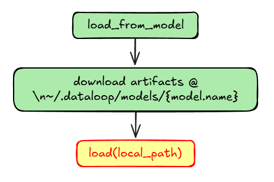
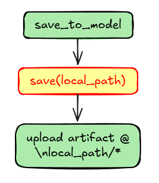
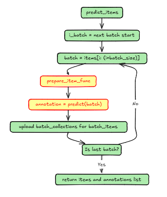
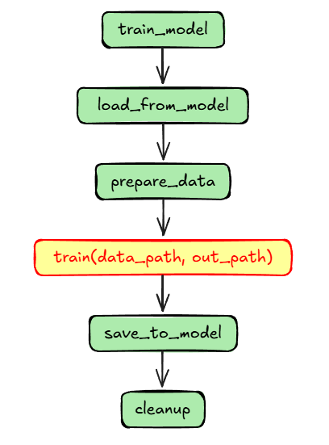
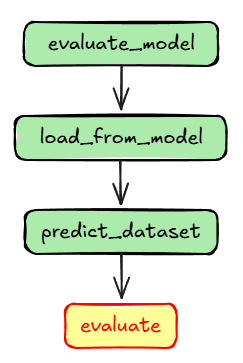

# Understanding Model Adapters: The Magic Behind the Scenes 🎭

Ever wondered how Dataloop seamlessly integrates with your ML models? Let's peek behind the curtain and explore the Model Adapter's inner workings! 

## The Two Types of Functions 🎭

Think of the Model Adapter as a theater production with two types of actors:

1. 🎬 **Wrapper Functions** - The stage managers who handle all the behind-the-scenes work
   - Part of the `BaseModelAdapter` class
   - Handle data movement, file management, and coordination
   - Make your life easier by managing the complex stuff

2. 🎭 **User Functions** - The star performers you get to direct
   - Functions you implement in your `ModelAdapter`
   - Contain your model's specific logic
   - Turn your ML model into a Dataloop-ready superstar

Let's meet our cast of characters!

## The Stage Managers: Wrapper Functions 🎬

### `load_from_model`: The Setup Crew 📦



What happens:
1. 📥 Downloads your model's artifacts
2. 📂 Creates a cozy home at `~/.dataloop/models/{model.name}`
3. 🎯 Calls your `load` function to bring the model to life

Your files will be organized like this:
```
DATALOOP_PATH/
└── models/
    └── model.name/
        └── artifacts/
```

### `save_to_model`: The Preservation Expert 💾


What happens:
1. 💾 Calls your `save` function to package up the model
2. ☁️ Uploads everything to Dataloop's cloud
3. ✨ Keeps your model safe and sound

### `predict_items`: The Performance Director 🎯



The show must go on! Here's how:
1. 🎬 Creates batches of items
2. 🎨 Prepares each batch using your `prepare_item_func`
3. 🎯 Makes predictions using your `predict` function
4. 📝 Saves the results as annotations
5. 🔄 Repeats until all items are processed

### `train_model`: The Training Coach 🏋️‍♂️




Your model's training journey:
1. 📥 Loads the current model state
2. 🎯 Prepares training data
3. 🏋️‍♂️ Trains using your `train` function
4. 💾 Saves the improved model
5. 🧹 Cleans up temporary files

Your training data will be organized like this:
```
DATALOOP_PATH/
└── models/
    └── model.name/
        └── artifacts/
└── model_data/
    └── model.id_model.name/
        └── timestamp/
            ├── output/
            └── datasets/
                └── dataset.id/
                    ├── train/
                    │   ├── items/
                    │   └── json/
                    └── validation/
                        ├── items/
                        └── json/
```

### `evaluate_model`: The Performance Reviewer 📊



How your model gets its report card:
1. 📥 Loads the latest model version
2. 🎯 Makes predictions on test data
3. 📊 Compares with ground truth
4. 📈 Generates performance metrics

## Your Star Performers: User Functions 🌟

### Required Functions for Different Use Cases:

#### For Prediction Only:
- `load` 📥 - Brings your model to life
- `predict` 🎯 - Makes predictions on data

#### For Training:
- Everything above, plus:
- `train` 🏋️‍♂️ - Teaches your model new tricks
- `save` 💾 - Preserves your model's knowledge

### Function Details

#### `load` 📥
```python
def load(self, local_path, **kwargs):
    """Load your model from files"""
    self.model = YourModel.load(local_path)
```

#### `save` 💾
```python
def save(self, local_path, **kwargs):
    """Save your model's state"""
    torch.save(self.model.state_dict(), f'{local_path}/weights.pth')
```

#### `train` 🏋️‍♂️
```python
def train(self, data_path, **kwargs):
    """Train your model on new data"""
    # Your training logic here
    pass
```

#### `predict` 🎯
```python
def predict(self, batch, **kwargs):
    """Make predictions and return Dataloop annotations"""
    predictions = self.model(batch)
    return convert_to_annotations(predictions)
```

#### `prepare_item_func` 🎨
```python
def prepare_item_func(self, item):
    """Prepare items for prediction"""
    return preprocess_for_model(item)
```

## Pro Tips for Model Adapter Success 💡

1. **Error Handling** 🛡️
   - Add proper logging in each function
   - Handle edge cases gracefully
   - Validate inputs and outputs

2. **Performance** ⚡
   - Optimize batch processing
   - Use efficient data loading
   - Clean up temporary files

3. **Best Practices** 📋
   - Document your functions clearly
   - Follow the function signatures
   - Test each component thoroughly

Need more help? Check out our [example implementations](https://github.com/dataloop-ai-apps/torch-models) or join our community! 🚀
