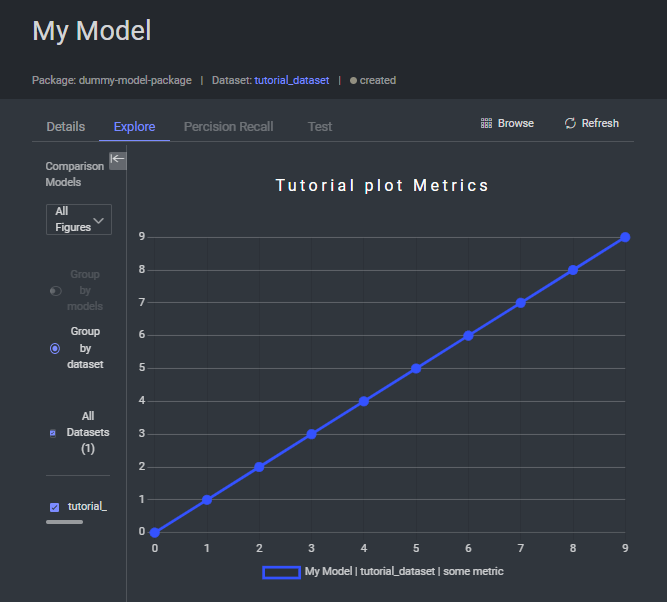

# Tracking Model Metrics: Your AI's Report Card 📊

Want to keep track of how well your model is performing? Let's explore how to log and visualize your model's metrics in Dataloop! 

## Getting Started 🚀

> 💡 **Pro Tip**: All models from our marketplace automatically track metrics. This guide is for custom models!

### What You'll Need 📋
- A Dataloop Package Kit (`dl.DPK`)
- A Model with a dataset ID (`dl.Model`)

## Setting Up Your Metrics Dashboard 🎯

First, let's create our tracking environment:

```python
import dtlpy as dl
import os
import numpy as np

# Connect to your project
project = dl.projects.get(project_name='your-awesome-project')

# Create a package for your model
dpk = project.dpks.publish()

# Install the DPK
project.apps.install(dpk=dpk)

# Create a model to track
model = dpk.models.create(
    model_name='My Tracked Model',
    description='A model with awesome metrics tracking',
    dataset_id='your-dataset-id',
    labels=[]
)
```

## Logging Your Metrics 📈

Let's add some training metrics! Here's a simple example tracking training progress:

```python
# Simulate training metrics
epochs = np.linspace(0, 9, 10)
accuracies = np.array([0.82, 0.85, 0.87, 0.89, 0.90, 0.91, 0.92, 0.93, 0.94, 0.95])
losses = np.array([0.5, 0.4, 0.35, 0.3, 0.25, 0.23, 0.2, 0.18, 0.15, 0.13])

# Log accuracy metrics
print("📊 Logging accuracy metrics...")
for epoch, accuracy in zip(epochs, accuracies):
    model.metrics.create(
        samples=dl.PlotSample(
            figure='Training Metrics',
            legend='Model Accuracy',
            x=epoch,
            y=accuracy
        ),
        dataset_id=model.dataset_id
    )

# Log loss metrics
print("📉 Logging loss metrics...")
for epoch, loss in zip(epochs, losses):
    model.metrics.create(
        samples=dl.PlotSample(
            figure='Training Metrics',
            legend='Training Loss',
            x=epoch,
            y=loss
        ),
        dataset_id=model.dataset_id
    )

print("✨ Metrics logged successfully!")
```

Your metrics will appear in your model's "Metrics" tab, looking something like this:



> 🎯 **Pro Tip**: Compare different training runs by selecting multiple metrics in the sidebar!

## Analyzing Your Metrics 📊

Want to dig into your metrics programmatically? Here's how:

```python
# List all metrics
print("🔍 Fetching metrics...")
metrics = model.metrics.list()

# Method 1: Iterate through samples
print("\n📊 Individual Metrics:")
for sample in metrics.all():
    print(f"Epoch {sample.x}: {sample.y:.3f}")

# Method 2: Convert to DataFrame
print("\n📈 Metrics DataFrame:")
df = metrics.to_df()
print(df.head())
```

## Best Practices for Metrics Tracking 👑

1. **Organization** 📋
   - Use consistent metric names
   - Group related metrics together
   - Add clear legends and labels

2. **Tracking Strategy** 🎯
   - Log metrics at regular intervals
   - Include both training and validation metrics
   - Track multiple performance indicators

3. **Visualization** 📊
   - Use appropriate plot types
   - Include units when relevant
   - Keep plots clean and readable

## Pro Tips 💡

1. **Real-time Monitoring** ⚡
   ```python
   # Log metrics during training
   for epoch in range(num_epochs):
       # Your training loop
       model.metrics.create(
           samples=dl.PlotSample(
               figure='Live Training',
               legend='Accuracy',
               x=epoch,
               y=current_accuracy
           ),
           dataset_id=model.dataset_id
       )
   ```

2. **Custom Metrics** 🎨
   ```python
   # Log multiple metrics types
   model.metrics.create(
       samples=[
           dl.PlotSample(figure='Performance', legend='Precision', x=epoch, y=precision),
           dl.PlotSample(figure='Performance', legend='Recall', x=epoch, y=recall),
           dl.PlotSample(figure='Performance', legend='F1', x=epoch, y=f1_score)
       ],
       dataset_id=model.dataset_id
   )
   ```

Happy tracking! 📈
